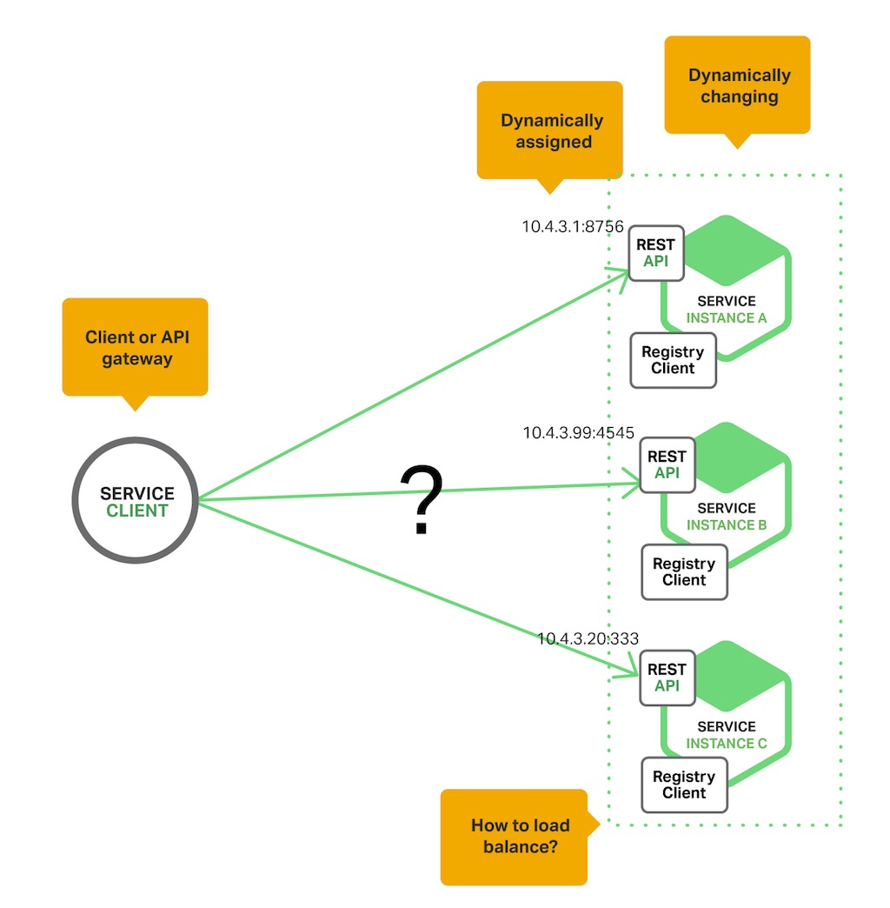
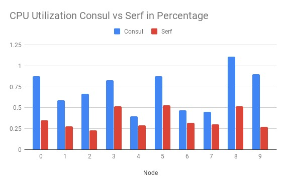
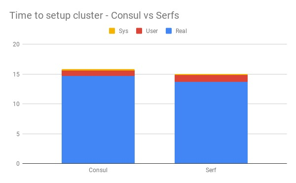

# Distributed System of Micro Services
This project aims to solve the problem of distributed system of microservices using  Serfnode. Through this project, we focus on enhancing the original solution and plans to steer the implementation in that direction. We try to address the aspects of service registration, service discovery and availability concerns in a small distributed system of microservices. Also, the service registration and service discovery of Ubuntu Docker images and failover capabilities between them is successfully demonstrated. Finally, we  analyse the solution and compare it with classical service discovery solutions with respect to time to recognize failure, space in terms of agents to operate successfully and service availability.

## What is service discovery?
Service discovery is about finding the network location of a service provider. It is the automatic detection of devices and services offered by these devices on a computer network.

Components of service discovery:  

1. **Service provider**: It registers itself with service registry when it enters and de-register itself when it leaves the system.
2. **Service consumer**: It gets the location of a provider from registry, and then talks to the provider
3. **Service registry**: It maintains the latest location of providers.

<p align="center">
  <br>
  <a align="center"> Service Discovery </a>
</p>

## What is serf ?
Serf is a tool for cluster membership, failure detection, and orchestration that is decentralized, fault-tolerant and highly available. Serf runs on every major platform: Linux, Mac OS X, and Windows. It is extremely lightweight: it uses 5 to 10 MB of resident memory and primarily communicates using infrequent UDP messages.  

Serf uses an efficient gossip protocol to solve three major problems:  

1. **Membership**: Serf maintains cluster membership lists and is able to execute custom handler scripts when that membership changes. For example, Serf can maintain the list of web servers for a load balancer and notify that load balancer whenever a node comes online or goes offline.

2. **Failure detection and recovery**: Serf automatically detects failed nodes within seconds, notifies the rest of the cluster, and executes handler scripts allowing you to handle these events. Serf will attempt to recover failed nodes by reconnecting to them periodically.

3. **Custom event propagation**: Serf can broadcast custom events and queries to the cluster. These can be used to trigger deploys, propagate configuration, etc. Events are simply fire-and-forget broadcast, and Serf makes a best effort to deliver messages in the face of offline nodes or network partitions. Queries provide a simple realtime request/response mechanism.

## What is consul ?
Consul is a service mesh solution providing a full featured control plane with service discovery, configuration, and segmentation functionality. Each of these features can be used individually as needed, or they can be used together to build a full service mesh. Consul requires a data plane and supports both a proxy and native integration model. Consul ships with a simple built-in proxy so that everything works out of the box, but also supports 3rd party proxy integrations such as Envoy.

The key features of Consul are:

1. **Service Discovery**: Clients of Consul can register a service, such as api or mysql, and other clients can use Consul to discover providers of a given service. Using either DNS or HTTP, applications can easily find the services they depend upon.

2. **Health Checking**: Consul clients can provide any number of health checks, either associated with a given service ("is the webserver returning 200 OK"), or with the local node ("is memory utilization below 90%"). This information can be used by an operator to monitor cluster health, and it is used by the service discovery components to route traffic away from unhealthy hosts.

3. **KV Store**: Applications can make use of Consul's hierarchical key/value store for any number of purposes, including dynamic configuration, feature flagging, coordination, leader election, and more. The simple HTTP API makes it easy to use.

## What is gossip protocol?
A gossip protocol is a distributed communication paradigm inspired by the gossip phenomenon that can be observed
in social networks. Initially born to efficiently disseminate information, as its human counterpart, it has been later used to solve several other problems, such as failure detection, data aggregation, distributed topology construction, resource allocation

## Steps to reproduce

Below are the steps to reproduce the project results.

### Installing Docker

1. Install docker for ubuntu [link](https://docs.docker.com/install/linux/docker-ce/ubuntu/)
2. Check installation status:  

```
$ docker
A self-sufficient runtime for containers <br> 

Options:
      --config string      Location of client config files (default "/home/sharath/.docker")
  -D, --debug              Enable debug mode
  -H, --host list          Daemon socket(s) to connect to
  -l, --log-level string   Set the logging level
                           ("debug"|"info"|"warn"|"error"|"fatal") (default "info")
      --tls                Use TLS; implied by --tlsverify
      --tlscacert string   Trust certs signed only by this CA (default
                           "/home/sharath/.docker/ca.pem")
      --tlscert string     Path to TLS certificate file (default
                           "/home/sharath/.docker/cert.pem")
      --tlskey string      Path to TLS key file (default "/home/sharath/.docker/key.pem")
      --tlsverify          Use TLS and verify the remote
  -v, --version            Print version information and quit
```

### Setting up serf-nodes

1. Build docker image from source `$ docker build -t sharath/serfnode`.
2. Source rc file `$ . .rcSerfnode`.
3. Start cluster of 5 serfnodes `$ serf-start-cluster 5`.
4. Enter in bash shell of serfnode4 `$ docker exec -i -t serfnode4 /bin/bash`.
5. Check Service discovery `root@serfnode4:/# serf members`.
6. Access primary serfnode webserver `root@serfnode4:/# curl $SERF_JOIN_IP`.
7. Open new terminal and force stop serfnode0 `$ docker stop serfnode0`.
8. Check Service dicovery and status of serfnode0 from serfnode4 `root@serfnode4:/# serf members`.
9. Access new primary serfnode webserver `root@serfnode4:/# curl $SERF_JOIN_IP`.
10. Note: `$SERF_JOIN_IP` is passed as environmental variable when creating serfnode container instance.

### Setting up consul-nodes

1. Build docker image from source `$ docker build -t sharath/consulnode`.
2. Source rc file `$ . .rcConsulnode`.
3. Start cluster of 5 serfnodes `$ consul-start-cluster 5`.
4. Enter in bash shell of serfnode4 `$ docker exec -i -t consulnode4 /bin/bash`.
5. Check Service discovery `root@consulnode4:/# consul members`.
6. Access primary serfnode webserver `root@consulnode4:/# curl $CON_JOIN_IP`.
7. Open new terminal and force stop consulnode0 `$ docker stop consulnode0`.
8. Check Service dicovery and status of serfnode0 from serfnode4 `root@consulnode4:/# consul members`.
9. Access new primary serfnode webserver `root@consulnode4:/# curl $CON_JOIN_IP`.
10. Note: `$CON_JOIN_IP` is passed as environmental variable when creating serfnode container instance.


## Comparison and logs

<p align="center">
  <br>
  <a align="center"> CPU Utilization</a>
</p>


<p align="center">
  <br>
  <a align="center"> Time Ellapsed</a>
</p>


## References

